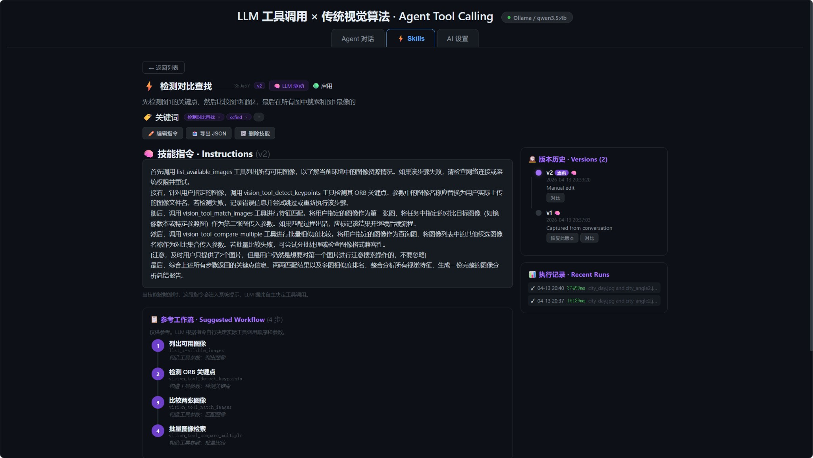

# LLM Tool Calling x 传统视觉算法

FastAPI 后端 + 单页前端：Ollama / OpenAI 兼容 API + ORB 等视觉工具（Function Calling）。

LLM 自主决定何时调用哪些工具，通过 Skills 机制注入系统提示，对齐 Anthropic 等提出的 *Agent Skills* 思路。

## 界面预览

### Agent 对话


### Skills 管理



### AI 设置


## 快速开始

```bash
pip install fastapi uvicorn httpx opencv-python numpy python-multipart pytest
python server.py
# http://localhost:8765
```

需要本地 Ollama 或在页面 **AI 设置** 中配置云端供应商（OpenAI 等）。

> 修改 `styles.css` 或 `js/` 后请**重启 `server.py`**，以便加载最新静态资源。

## 架构概览

```
┌─────────────────────────────────────────────────────┐
│                   前端 (单页应用)                     │
│  图像库  │  对话区（瀑布流追踪）  │  工具箱 + Skills   │
└──────┬──────────────────────┬───────────────────────┘
       │  SSE / JSON API      │
┌──────▼──────────────────────▼───────────────────────┐
│                   server.py (FastAPI)               │
│  AI 供应商代理  │  工具执行（ORB 视觉）  │  技能管理  │
└─────────────────────────────────────────────────────┘
                      │
              ┌───────▼────────┐
              │   Ollama / API  │
              │   (本地或云端)    │
              └─────────────────┘
```

- **AI 供应商代理**：支持 Ollama（本地）和 OpenAI 等云端 API
- **视觉工具**：ORB 关键点检测、匹配、图像检索等
- **技能（Skills）**：通过 LLM 生成的系统提示指令，可版本管理与 diff 比较

## 核心概念：Skills

技能与「固定脚本跑工具」不同：每条技能的 **`system_prompt_addon`** 会注入系统提示，由 **LLM 自主决定何时调用哪些工具**。

| 字段 | 含义 |
|------|------|
| `keywords` | 用户消息命中关键词即激活该技能 |
| `system_prompt_addon` | 注入系统提示的自然语言指令（主配置） |
| `suggested_workflow` | 仅作 UI 展示的参考步骤列表，**不**被后端按序执行 |
| `versions` / `active_version` | 版本与变更说明；支持 diff |

**激活方式**：用户消息以某关键词开头（忽略大小写），服务端在系统提示末尾追加「强制技能说明」块。

**保存为技能**：对话追踪条上的「保存为技能」可把一次运行的工具轨迹发送到 `POST /api/skills/capture`。服务端会尝试用当前 **AI 设置** 里的模型生成指令文本；失败则使用机械模板。

## 前端模块

| 文件 | 说明 |
|------|------|
| `index.html` | 页面骨架，按依赖顺序加载 `js/` |
| `styles.css` | 全部样式 |
| `js/utils.js` | HTML 转义、Markdown 格式化、JSON 高亮、lightbox |
| `js/state.js` | 共享可变状态 `App.state` |
| `js/resize.js` | 对话区高度、工具箱宽度（localStorage 持久化） |
| `js/image-library.js` | 图像库加载、多选、上传 |
| `js/pipeline.js` | 顶部动态流水线渲染 |
| `js/toolbox.js` | 工具箱卡片与运行时参数展示 |
| `js/chat.js` | 消息渲染、SSE 解析、追踪条 |
| `js/skills.js` | 技能列表、捕获弹窗 |
| `js/skill-editor.js` | 技能详情、版本编辑与 diff |
| `js/settings.js` | AI 供应商配置、模型表 |
| `js/conversation.js` | 对话持久化、历史记录抽屉 |
| `js/app.js` | 启动入口，调用各模块 `init*` |

全局命名空间为 **`window.App`**（无打包器）。

## 流水线追踪

页面顶部动态流水线展示每一轮对话的执行步骤：

- **统计信息**：总耗时、LLM 轮次数（🧠）、工具执行次数（⚙️）、token 数、步骤总数
- **横向滚动**：`#pipeline-flow` 使用 `overflow-x: auto`
- **详情面板**：点击某步展示该阶段的 `llm_request` / `llm_response` / `tool_args` / `tool_result` JSON

## CLI（供 Agent / 自动化使用）

`cli.py` 将 ORB 视觉工具暴露为命令行接口，所有输出均为 **JSON**（stdout）：

```bash
# 列出可用图像
python cli.py list

# 检测关键点
python cli.py detect city_day.jpg -o keypoints.jpg

# 匹配两张图像
python cli.py match city_day.jpg city_angle2.jpg -o match_vis.jpg

# 图像检索（返回排名）
python cli.py search city_day.jpg --all

# 指定候选集
python cli.py search city_day.jpg forest.jpg beach.jpg mountain.jpg

# 额外搜索目录
python cli.py list --db-dir /path/to/my_images
python cli.py search query.jpg --all --db-dir /data/images

# 生成测试图像（首次运行可选）
python cli.py generate
```

不加 `-o` 时，可视化以 `visualization_base64`（JPEG base64）出现在 JSON 中。
错误时输出 `{"error": "..."}` 并以非零退出码返回。

## 测试

```bash
python -m pytest tests/ -v
```

- `tests/test_frontend_contract.py`：对 `index.html` + `styles.css` + `js/*.js` 做字符串契约测试
- `tests/test_server.py`：ASGI 接口测试（LLM 调用通过 mock）

## 相关 API

| 端点 | 说明 |
|------|------|
| `GET /` | 返回 `index.html` |
| `GET /styles.css` | 样式表 |
| `GET /js/*` | JS 模块（StaticFiles） |
| `GET /api/settings` | 获取 AI 供应商配置 |
| `PUT /api/settings` | 更新 AI 供应商配置 |
| `POST /api/chat` | 对话接口（SSE 流式） |
| `GET/POST /api/skills` | 技能列表 / 创建 |
| `GET/PUT /api/skills/{id}` | 技能详情 / 更新 |
| `POST /api/skills/capture` | 从对话轨迹捕获技能 |
| `POST /api/skills/{id}/execute` | 预览技能指令 |
| `GET /api/skills/{id}/diff/{v1}/{v2}` | 版本 diff |
